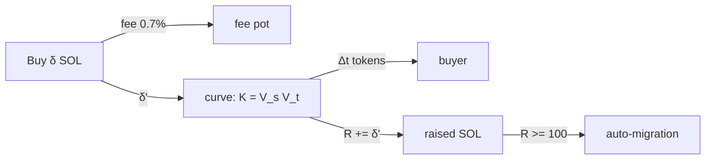
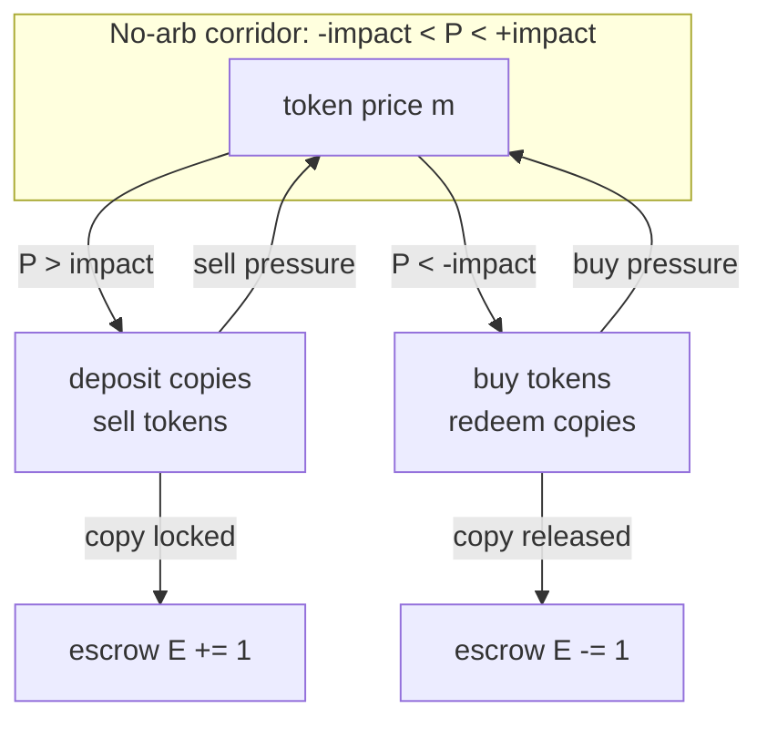
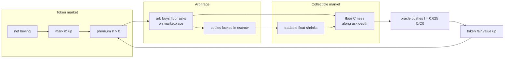
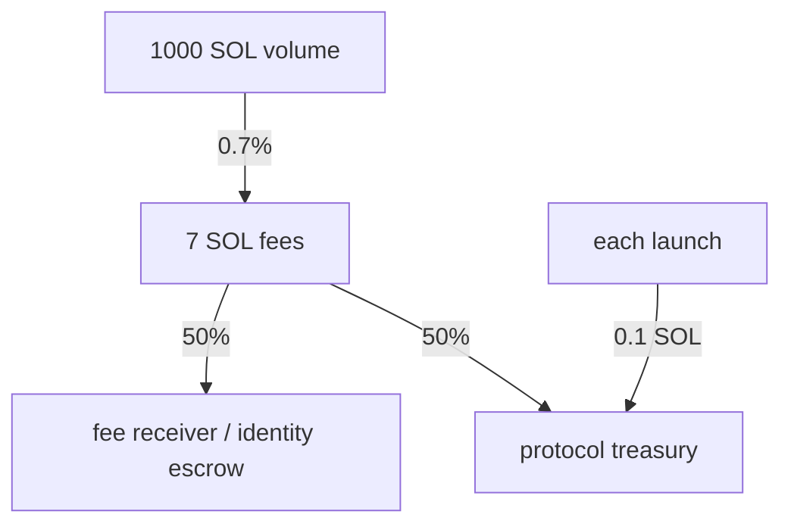

# floorlaunch economics masterfile

The complete quantitative model: every flow a user can send at a market, the
exact math it executes, what it does to the token price, and how and when it
transmits into the underlying collectible's price. Formulas match the deployed
program (`programs/floorlaunch/src/lib.rs`); worked numbers use the launch
convention and the live Frogana market as the example.

Diagram sources (mermaid) are embedded per section so figures can be generated
straight from this file and iterated. Final rendered figures live in
`docs/images/economics/` with their matplotlib sources in `docs/figures-src/`
(regenerate with `python3 fig_charts.py && python3 fig_flows.py`). All notation
is defined once in section 0.

---

## 0. Notation and launch constants

| Symbol | Meaning | Launch value |
| --- | --- | --- |
| `S` | Total token supply | 1,000,000,000 (1B) |
| `u` | One "unit" = 1M tokens; index and mark are quoted per unit | |
| `V_s` | Curve virtual SOL reserve | 25 SOL |
| `V_t` | Curve virtual token reserve | 1B (full supply) |
| `R` | Cumulative SOL raised on the curve (net of fees) | 0 → 100 |
| `G` | Graduation target | 100 SOL |
| `f` | Trade fee | 0.70% (70 bps), SOL paths only |
| `C(t)` | Collectible's real price (marketplace floor / graded price) | Frogana: 0.44 SOL at launch |
| `C_0` | Collectible price at launch | |
| `I(t)` | On-chain oracle index per unit (launch-scaled) | `0.625 * C(t)/C_0` SOL |
| `m(t)` | Mark EMA per unit (the token's smoothed venue price) | seeded at 0.025 SOL |
| `s(t)` | Venue spot per unit (curve or AMM) | opens at 0.025 SOL |
| `k` | Units per item: how many units one physical copy was worth at launch | `C_0 / 0.625` (Frogana: 0.704) |
| `P` | Premium `m/I - 1` | 0 at migration by construction |
| `E` | Copies held in the market's item escrow | starts 0 |

Two identities that make everything below clean:

- **Unit scaling:** `I(t) * k = C(t)` exactly. The launch-scaled index times the
  item's size is always the collectible's current price. (Why: `I = 0.625 *
  C/C_0` and `k = C_0/0.625`.)
- **Migration parity:** the curve closes at `s = 0.625` SOL/unit and `I` starts
  at 0.625, so the AMM opens at premium `P = 0` in every market regardless of
  the collectible.

---

## 1. The curve phase (bootstrap)

Constant product on virtual reserves. Invariant `K = V_s * V_t` with
`V_s = 25`, `V_t = 1e9` tokens at creation.

**State after raising `R`:**

```
spot per token   p(R)  = (25 + R)^2 / (25 * 1e9)      [SOL/token]
market cap       MC(R) = (25 + R)^2 / 25              [SOL]
tokens sold      T(R)  = 1e9 * R / (25 + R)
```

Checkpoints: `MC(0) = 25`, `MC(50) = 225`, `MC(100) = 625` SOL.
`T(100) = 800M` sold; 200M remain (part seeds the AMM, rest burns).

**A buy of `δ` SOL at state `R`** (fee `f` skimmed first, `δ' = δ(1-f)`):

```
tokens received  Δt = 1e9 * 25 * δ' / ((25 + R)(25 + R + δ'))
new market cap   MC' = (25 + R + δ')^2 / 25
price multiple   MC'/MC = ((25 + R + δ') / (25 + R))^2     <- quadratic in raise
```

A sell of `Δt` tokens is the exact inverse walk down the same curve (sells
reduce `R`; the curve can never be drained below its starting point).

**Worked (Frogana, fresh launch):** a 1 SOL buy at `R = 0`: `δ' = 0.993`,
`Δt ≈ 38.2M` tokens, MC moves 25 → 27.0 SOL (+8.1% price). The same 1 SOL at
`R = 90`: `Δt ≈ 1.86M` tokens, MC 529 → 538.2 (+1.7%). Early SOL buys ~20x
the tokens and moves price ~5x harder: the curve front-loads discovery.



---

## 2. Migration

Fires automatically when `R >= G` (keeper cranks it; permissionless).

- Insurance share is 0 under the launch convention: **the full raise seeds the
  AMM**: `x_0 = R` SOL against `y_0 = R / p_close` tokens, price-matched to the
  curve's closing spot (~0.625 SOL/unit, ~625 SOL MC).
- Unsold curve tokens beyond the AMM seed **burn**. Supply only ever shrinks.
- The mark EMA carries over continuously (it was fed by curve spot all along),
  and `P = 0` at the instant of migration by the unit-scaling construction.

Verified live: 104.27 SOL raised → AMM opened 104.27 SOL / 156.0M tokens.

---

## 3. The AMM phase (live)

Real-reserve constant product, `x * y = K`, spot per token `s = x/y`.

**Buy `δ` SOL:** `Δt = y * δ' / (x + δ')`, `δ' = δ(1-f)`.
**Sell `Δt` tokens:** `ΔSOL = x * Δt / (y + Δt)`, fee off the output.

**Price impact of a buy relative to pool depth:** new spot / old spot
`= ((x + δ')/x)^2`. Rule of thumb at the 100 SOL opening pool: 1 SOL moves
price ~+2%, 5 SOL ~+10%, 10 SOL ~+21%. Impact halves as the pool doubles.

**Mark EMA** (the price everything else keys off): per trade,

```
m ← m + min(dt, W)/W * (s - m),   W = mark window (60s)
```

A single-block spike moves `m` by at most `dt/W` of the gap: this is why item
swaps and funding cannot be sandwiched inside one transaction.

---

## 4. The oracle index

The relayer reads the collectible's live market (Magic Eden floor for NFTs,
graded-price feed for cards) and pushes the launch-scaled index every ~5 min:

```
I_push = 0.625 * C_now / C_0        [SOL per unit]
```

On-chain, pushes are EMA'd (window 30s), rate-limited, and bounded by the
circuit breaker: a push deviating more than 30% from the TWAP freezes the
market instead of moving it. Staleness beyond 1h blocks the index-dependent
operations (shorts, withdrawals with debt, funding, liquidations, item swaps).

---

## 5. Item swaps: the two-way door (feeless)

The market escrow accepts real registered copies and pays tokens, or accepts
tokens and releases copies. **No fee in either direction, deliberately**: the
SOL paths pay 0.70%, the real-thing path pays nothing, so the arbitrage below
is never taxed.

**Deposit one copy →** receive `T_d` tokens with
`T_d * m = I * k = C` (identity from section 0). You always receive exactly
the collectible's current value, priced at the smoothed mark.

**Redeem one copy →** pay `T_w` tokens with `T_w * m = C`. First-come against
escrow inventory `E`.

**The arbitrage bands.** Let `P = m/I - 1` (premium). Ignoring gas:

- Deposit-and-sell profit per copy ≈ `C * (s/m - 1)` at spot `s`; over a
  holding horizon it converges to ≈ `C * P` minus the price impact of selling
  `T_d` tokens. **Deposits switch on when `P > impact(T_d)`.**
- Buy-and-redeem profit per copy ≈ `C * (-P) - impact(T_w)`. **Redemptions
  switch on when `P < -impact(T_w)`**, and are capped by escrow inventory `E`.

Because swaps are feeless, the no-arbitrage corridor is only as wide as
price impact + EMA lag: single-digit percent at the opening pool depth, and it
tightens as liquidity deepens.



---

## 6. Transmission into the collectible

This is the section the whole design exists for: how token flows reach `C`.

**Buy-side transmission (the supply sink).**

1. Token buying lifts `s`, then `m`; premium `P` goes positive.
2. When `P` clears the impact threshold, depositing copies is profitable.
3. Rational depositors source the **cheapest available copies**: they buy the
   collectible's floor asks on the marketplace to feed the escrow.
4. Each locked copy removes one unit from the collectible's tradable float
   and the ask that was bought is gone: `C` (a floor price) rises along the
   marketplace's ask-depth curve.
5. The oracle pushes the higher `C` into `I` within ~5 minutes, raising the
   token's fair value, which re-opens headroom for the loop at the new level.

The elasticity is set by marketplace depth: if the collectible has `n_x` asks
within `x%` of the floor, absorbing `d` copies moves the floor past
approximately the `d`-th ask. Thin collectibles (low listed count) move hard;
deep ones move slow. The aggregator's "Listed" column is exactly this number.

**Sell-side transmission (the bounded damper).**

1. Token selling drops `m`; premium goes negative past the corridor.
2. Redeemers buy cheap tokens and pull copies out of escrow: **buy pressure
   on the token**, cushioning its fall.
3. Released copies may be re-listed on the marketplace, pressing `C`: but this
   channel is **capped at `E`**, the copies the escrow actually holds. A
   market that absorbed 40 copies on the way up can release at most 40 on the
   way down. Downside transmission is structurally bounded; upside is bounded
   only by the marketplace's float.

**The hedge channel (no supply effect, price tether only).** Collectible
holders short the synth against SOL collateral (150% initial CR, 120%
maintenance). Funding flows `rate/day = clamp(P * k_f, ±cap)` from the rich
side to the cheap side, so a persistent premium pays hedgers to lean on it and
a persistent discount pays longs to close it. Hedging never moves copies.



---

## 7. Fee and value flows

| Flow | Rate | Destination |
| --- | --- | --- |
| Launch fee | 0.1 SOL flat | Protocol treasury |
| Curve/AMM trades | 0.70% of SOL leg | 50% market's fee receiver, 50% protocol (kept 5-min sweep) |
| Item swaps | **0** | (incentive: see section 5) |
| Funding | `clamp(P * k_f, ±cap)` per day on open debt | Between longs and hedge shorts |
| Liquidation | 5% bonus on repaid debt | Liquidator, shortfall covered by insurance fund |

Per 1,000 SOL of volume a market generates 7 SOL of fees: 3.5 to the fee
receiver (which can be an identity escrow for a community figure), 3.5 to the
protocol.



---

## 8. Every action, its price effect, one table

| Action | Token price `m` | Collectible `C` | Mechanism |
| --- | --- | --- | --- |
| Buy with SOL (curve) | Up, quadratic in raise | Delayed up via loop 6 | Curve math §1, transmission §6 |
| Buy with SOL (AMM) | Up by `((x+δ')/x)^2` | Delayed up via loop 6 | AMM math §3 |
| Sell for SOL | Down (mirror) | Damped; bounded by `E` | §3, §6 sell-side |
| Deposit a copy (buy with card) | Down slightly when arb sells the received tokens; net effect is corridor enforcement | **Up**: a floor ask was likely consumed; float shrinks | §5, §6 |
| Redeem a copy | Up (redeemer buys tokens first) | Down at most `E` copies' worth | §5, §6 |
| Open hedge short | Down pressure when shorts sell the drawn tokens | None directly | §6 hedge channel |
| Funding crank | Pulls `m` toward `I` over time | None | §6 |
| Oracle push | Re-anchors fair value | Input, not output | §4 |

**Key asymmetry worth a diagram of its own:** upside transmission (buys →
copies locked → floor up) is limited only by marketplace float; downside
transmission (sells → copies released) is hard-capped by escrow inventory.
The pool converts token volatility into a ratchet on the collectible's float.

---

## 9. Numbers appendix (for figure axes)

Launch convention curve, exact points for plotting `MC(R) = (25+R)^2/25`:

| R raised (SOL) | 0 | 10 | 25 | 50 | 75 | 100 |
| --- | --- | --- | --- | --- | --- | --- |
| Market cap (SOL) | 25 | 49 | 100 | 225 | 400 | 625 |
| Price per unit (SOL) | 0.025 | 0.049 | 0.100 | 0.225 | 0.400 | 0.625 |
| Tokens sold (M) | 0 | 286 | 500 | 667 | 750 | 800 |

AMM opening depth (100 SOL pool): buy impact `((100+δ)/100)^2 - 1`:

| Buy (SOL) | 1 | 2 | 5 | 10 | 25 |
| --- | --- | --- | --- | --- | --- |
| Price impact | +2.0% | +4.0% | +10.2% | +20.9% | +55.8% |

Frogana example constants: `C_0 = 0.44` SOL, `k = 0.704` units/copy, one copy
deposits for `0.44 / m` tokens (17.6M at the open, 704k at migration parity).
