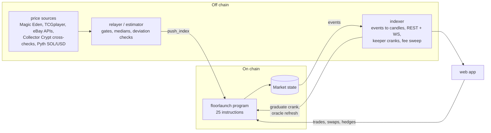
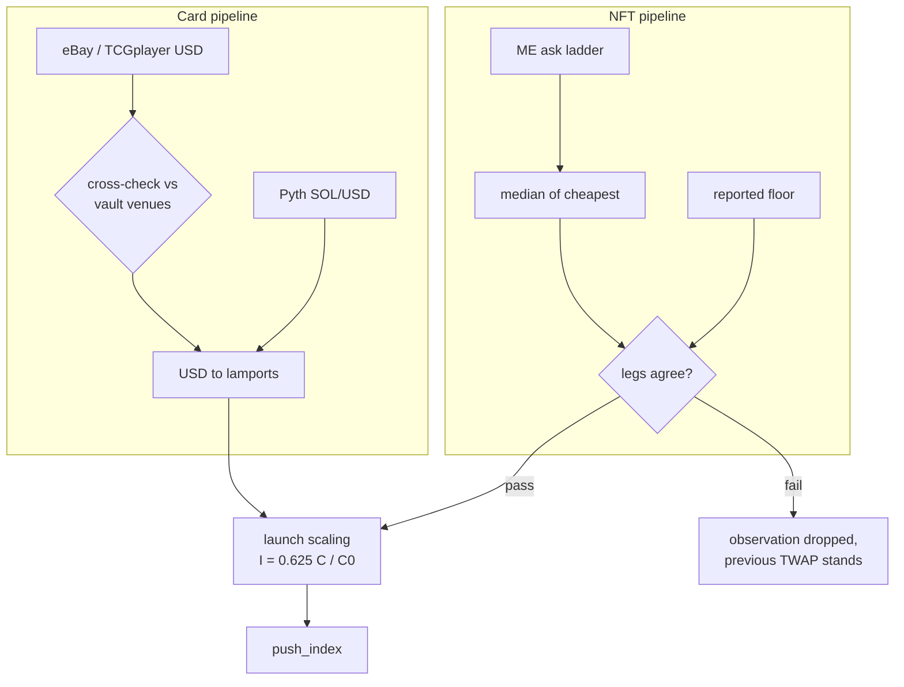
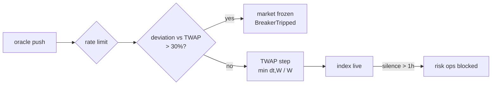
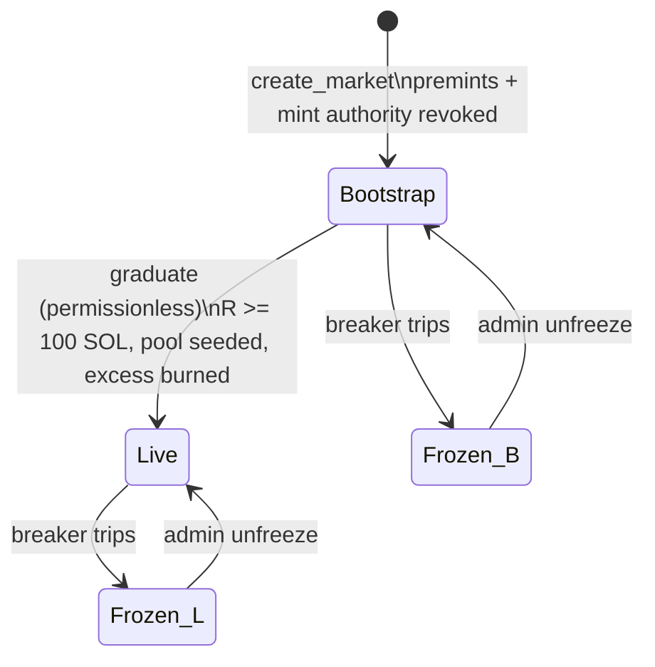
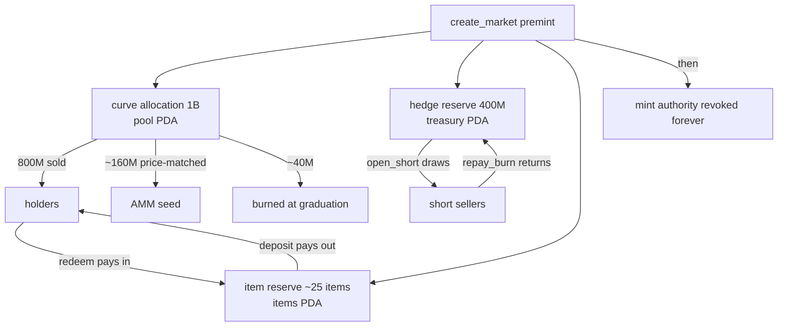
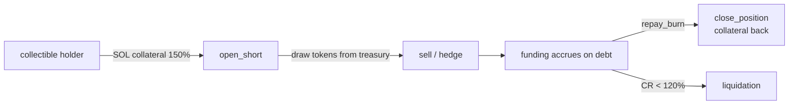
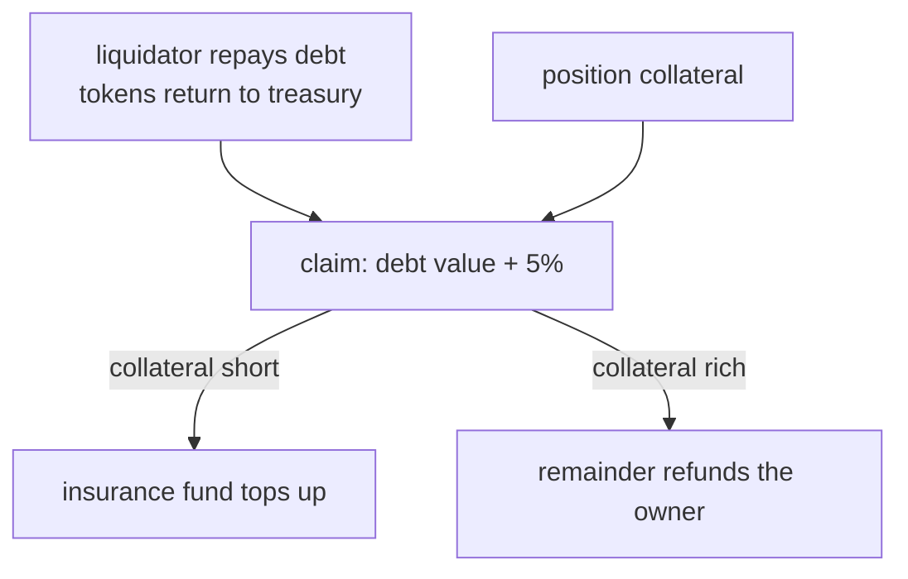
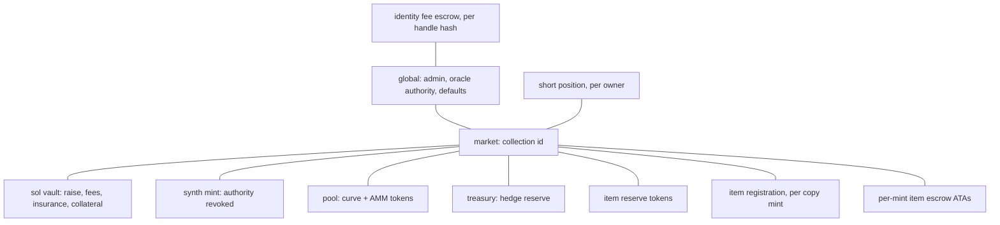

# floorlaunch protocol masterfile

Companion to `ECONOMICS-MASTER.md`. That file covers what flows do to prices;
this one covers the machinery: the oracle pipelines, the index defense stack,
the market state machine, the supply ledger, the CDP/short engine, funding,
liquidations, the account map, and the venue abstraction. Everything is
verified against `programs/floorlaunch/src/lib.rs` and the relayer source.
Each section carries a mermaid sketch and, where a chart fits, a plotting
table, in the same style system as the economics figures
(`docs/figures-src/fl_style.py`).

---

## 0. Parameter sheet (launch convention)

| Parameter | Value | Meaning |
| --- | --- | --- |
| `index_window_secs` | 30 | Index TWAP window |
| `mark_window_secs` | 60 | Mark EMA window |
| `min_push_interval_secs` | 0 | Oracle rate limit (relayer self-paces at ~5 min) |
| `breaker_bps` | 3000 | Push deviating >30% from TWAP freezes the market |
| `max_index_age_secs` | 3600 | Stale index blocks risk operations |
| `funding_k_bps` | 10000 | Funding sensitivity: rate = premium x 1.0 |
| `max_funding_bps_per_day` | 10000 | Funding clamp: +-100%/day of debt |
| `min_crank_interval_secs` | 1 | Funding crank rate limit |
| `initial_cr_bps` | 15000 | 150% collateral to open or withdraw |
| `maintenance_cr_bps` | 12000 | Below 120% is liquidatable |
| `liq_bonus_bps` | 500 | Liquidator earns 5% of repaid debt value |
| `max_open_interest` | 400M tokens | Hedge reserve premint = hard OI cap |
| `item_reserve` | 25 items' worth | Item-swap premint |
| `curve/amm fee` | 70 bps | SOL paths only |
| `insurance_share_bps` | 0 | Full raise seeds the AMM |

Curve virtuals (25 SOL / 1B) are **immutable after creation**; other params are
admin-updatable pre-multisig.

---

## 1. System architecture

Four processes, one program.



The keeper duties (auto-migration sweep, oracle refresh, fee sweep) are all
**permissionless cranks**: the indexer runs them for UX, but anyone can.

---

## 2. The two oracle pipelines

One program-side interface (`push_index`, lamports per unit), two estimators.

**NFT floors:** Magic Eden ask ladder → median of the cheapest listings →
cross-checked against the venue's reported floor; the observation is rejected
if legs disagree beyond a deviation bound or the sample is too thin.

**Graded cards:** USD price from sales aggregators (eBay solds, TCGplayer)
cross-checked against tokenized-vault venues, then converted through Pyth
SOL/USD. The synth therefore carries card-vs-SOL exposure; USD in the app is
display only.

Both pipelines emit the **launch-scaled index** `I = 0.625 * C/C_0` (see the
economics masterfile for why).



---

## 3. The index defense stack

Layered by time scale. Be precise about what the EMA does and does not do:
`ema_step` moves the TWAP by `min(dt, W)/W` of the gap, so a push arriving
**after a full window (30s) adopts the new value entirely**. Smoothing only
throttles rapid-fire sequences; the standing defenses between pushes are the
breaker and the staleness gate.

| Layer | Time scale | Defense |
| --- | --- | --- |
| Estimator gates | per observation | Bad data never leaves the relayer |
| Rate limit | seconds | Push cadence bounded on chain |
| TWAP step | < 30s | Burst of pushes can only move the index fractionally |
| Circuit breaker | any single push | >30% deviation freezes the market instead of moving it; the frozen index cannot be walked because pushes are refused while frozen |
| Staleness gate | > 1h silence | Shorts, debt withdrawals, funding, liquidations, item swaps all block |
| Funding clamp | days | Even a wrong index leaks at most 100%/day of open debt, and OI is capped by the hedge reserve premint |



**Worked bound (for a figure):** manipulated index at the breaker edge (+30%)
with full OI drawn: worst daily value transfer =
`max_open_interest * value * 30% * clamp` bounded by
`400M tokens * price * 100%/day`: a bounded, slow leak, never an event.

---

## 4. Market state machine

Two statuses, one orthogonal flag.



| Operation | Bootstrap | Live | Frozen |
| --- | --- | --- | --- |
| curve_buy / curve_sell | yes | no | no |
| amm_buy / amm_sell | no | yes | no |
| deposit_item / withdraw_item | yes | yes | no |
| open_short / accrue_funding / liquidate | no | yes | no |
| add_collateral | yes | yes | **yes** |
| push_index | yes | yes | **no** (anti TWAP-walk) |
| admin unfreeze / params | yes | yes | yes |

---

## 5. The supply ledger

Fixed supply by construction: everything is preminted in `create_market`, then
the mint authority is revoked **in the same transaction**. After that, supply
can only move between accounts or shrink.



Conservation invariant for a figure: `curve + treasury + items + holders + amm
= premint - burned`, at every block.

---

## 6. The CDP short engine

Collectible holders hedge by minting synth against SOL collateral.

- **Open:** deposit `col` SOL, draw `d` tokens; requires
  `col >= 1.5 * value_at_index(d)`.
- **Debt is stored funding-scaled**: `debt_scaled = d / funding_index`, so one
  global number reprices every position when funding accrues.
- **Repay and burn** shrinks debt; **close** returns collateral once debt is 0.
- **Withdraw collateral** allowed down to 150% CR with a fresh index.



**CR bands for a chart:** safe above 150%, warning 120-150% (no new draws, no
withdrawals), liquidatable below 120%. Plot collateral value vs debt value
with the two rays `col = 1.5 * debt` and `col = 1.2 * debt`.

---

## 7. Funding, exactly

Per crank (rate-limited, dt capped at one day):

```
premium_bps = (mark - index) / index * 10000
rate/day    = clamp(premium_bps * k / 10000, +-10000 bps)
delta       = funding_index * rate * min(dt, 1 day) / 1 day
funding_index -= delta
```

Mark **above** index → funding_index falls → every short's effective debt
shrinks: **shorts get paid** for leaning against a rich token. Mark **below**
index → debt grows → shorts buy-and-burn to exit: **buy pressure** under a
cheap token. The linear step can never zero the index, and a late crank
forfeits the excess gap rather than applying it retroactively.

**Plotting table (rate vs premium, k = 1.0):**

| Premium | -150% | -100% | -50% | -10% | 0 | +10% | +50% | +100% | +150% |
| --- | --- | --- | --- | --- | --- | --- | --- | --- | --- |
| Funding, %/day (to shorts) | -100 (clamped) | -100 | -50 | -10 | 0 | +10 | +50 | +100 | +100 (clamped) |

---

## 8. The liquidation waterfall

Below 120% CR, anyone can repay the debt from their own tokens and claim:

```
target_payout = debt_value + 5% bonus
payout        = min(target_payout, collateral)
shortfall     = target_payout - payout   -> topped up from insurance fund
owner_refund  = collateral - payout      -> whatever remains goes back
```



Worked example for a figure: debt worth 10 SOL, collateral 11.5 SOL (CR 115%):
payout 10.5, owner refund 1.0, insurance untouched. Same debt, collateral 9.8:
payout 9.8 + 0.7 from insurance.

---

## 9. Account map (PDAs)



Seeds: `["market", collection]`, `["vault"|"mint"|"pool"|"treasury"|"items",
market]`, `["item", market, item_mint]`, `["short", market, owner]`,
`["escrow", sha256(platform:handle)]`.

---

## 10. Venue abstraction

| | Internal (current launches) | External (Meteora DBC) |
| --- | --- | --- |
| Curve + AMM | This program | Meteora DBC → DAMM v2 |
| Mint custody | Program PDA, authority revoked | External fixed-supply mint |
| CDP supply | Treasury premint draw | Funded treasury reserve (SPL transfer in) |
| Mark price | AMM spot → 60s EMA on chain | Relayer reads DAMM pool, `push_mark` (EMA'd, rate-limited) |
| Creator fees | 50% of 0.70%, keeper-swept | Native Meteora split, on-chain |
| Starts | Bootstrap | Live immediately |

The synthetic layer (index, funding, shorts, item pools) is identical on both.

---

## 11. Figure checklist

1. Architecture map (S1, mermaid → flow figure)
2. Twin oracle pipelines (S2)
3. Defense stack funnel with time scales (S3)
4. State machine + permission matrix (S4, diagram + table heat strip)
5. Supply ledger sankey (S5)
6. CDP lifecycle + CR bands chart (S6, use the two-ray plot)
7. Funding curve: rate vs premium with clamp plateaus (S7, table above)
8. Liquidation waterfall with the two worked cases (S8)
9. PDA ownership graph (S9)
10. Venue split panel (S10)
